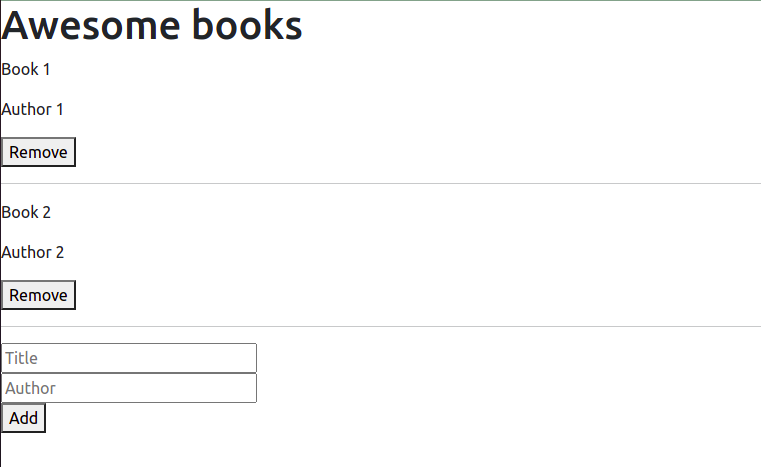

# Awesome Books

> In this project, we built a basic website that allows users to add/remove books from a list. We achieve that by using JavaScript objects and arrays. Also, we use dynamically modify the DOM and add basic events.

## Built With

- HTML
- Javascript

## Live Demo

[My portfolio](https://nachosala89.github.io/awesome-books/)

## Getting Started

To get a local copy up and running follow these simple example steps:
- Clone the repo to your computer.
- Open index.html in your browser.

👤 **Nacho Sala**

- GitHub: [@nachosala89](https://github.com/nachosala89)
- Twitter: [@nachosala89](https://twitter.com/nachosala89)
- LinkedIn: [Juan Ignacio Sala](https://www.linkedin.com/in/juan-ignacio-sala)

👤 **David Leonardo**

- GitHub: [@Fanger53](https://github.com/Fanger53)
- Twitter: [@DavidLe97005129](https://twitter.com/DavidLe97005129)

## 🤝 Contributing

Contributions, issues, and feature requests are welcome!

Feel free to check the [issues page](../../issues/).

## Show your support

Give a ⭐️ if you like this project!

## 📝 License

This project is [MIT](./MIT.md) licensed.